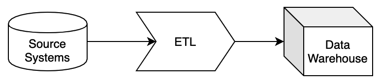

# Getting started

## What is ETL

ETL is the foundation of modern Business Intelligence application. 
It separates the analysis part from everything that comes before it. ETL stands for extract, transform 
and load, and describes a three-step process:

*Extracting* data is about acquiring it from a particular source and doing so in a way that all relevant data 
is collected. For ETL to work well, data needs to come directly from the source and in its rawest form.

*Transforming* data requires it to be stripped of its various formats, cleaned and harmonized. 
Put differently, it needs to become easy for the end user to read. 
Ensuring the highest possible data quality is crucial during this process, 
including detecting and removing duplicates and sorting the data into relevant, predetermined categories.

In the end, your ETL tool will help harmonize your data and *load* it into a target location, 
which essentially is a business intelligence (BI) or database tool of choice. 
There you can find it ready for your analysis.

## ETLBox core concepts

ETLBox is a data processing engine based on .NET Core, giving you the power to create your own ETL processes. 
This engine runs inside your applications, APIs, and jobs to extract, filter, transform, migrate data on-the-fly.
ETLBox speeds up your development by providing an easy-to-use toolbox for integrating your data from 
different sources within your app and load them into any target you like. 

### What you can do with ETLBox

Here are a few things you can do with ETLBox:

- Convert incoming data to a common format.
- Prepare data for analysis and visualization.
- Migrate between databases.
- Share data processing logic across web apps, batch jobs, and APIs.
- Power your data ingestion and integration tools.
- Consume large CSV, Excel or Json files

### Data integration

Data integration solves the problem of moving, transforming, and consolidating information from various sources like 
databases, applications, files, and web services. Bringing them together enables you to cleanse, standarize, 
de-duplicate, manipulate, and synchronize them. 
Data integration can play an important role in any project, and it can be critical to have a rock-solid solution in place
that is able to integrate numerous applications, services and databases. 
ETLBox as an Extract, transform, and load (ETL) tool is a perfect fit when you need to create a data integration solution.

### Common data API

ETLBox provides you with a single API for working with data. 
The API treats all data the same regardless of their source. 
By developing your applications against a single API, you can use the same components to process data 
regardless of whether they're coming from a database, Excel file, or 3rd-party API. 

### Embed inside your App

ETLBox fits well within your applications and services. It is a very lightweight library and has a very small footprint.
It's also complication free -  requiring no servers, installation, or config files. 
You just add it as a package reference into your app and start using it.

### In-flight Processing
ETLBox can run completely in-memory. In most cases, there's no need to store intermediate results 
in temporary databases or files on disk. Processing data in-memory, while it moves through the pipeline, 
can be more than 100 times faster than storing it to disk to query or process later.

### Flexible componentens
ETLBox comes with a set of components and tasks that simplify to read  data from various source, 
transform it on the fly and write it into different destinations. But all components offer you the ability 
to add your own logic in C# - and you can benefit here from the full power of the .NET framework. Even if 
your own data source or destination is not supported out of the box, you can easily add it yourself by extending
the `CustomSource` or `CustomDestination` components. 

### 100% .NET
ETLBox is built on .NET Core and .NET Standard and runs with the latest version of .NET. You write data flows and transformations 
in C# or any of the other .NET languages you know (e.g. VisualBasic or F#). 
You can also use your existing tools, IDEs, containers, and libraries. 
Being built on .NET Core means it can run on all servers, operating systems, and environments.

### Works with Big Data

ETLBox as an ETL tool was designed to handle big amounts of data and therefore you won't encounter any issues 
when you need to handle big data.Any dataflow can have a source, a transformation and a destination. 
While the source starts reading, it will post the data into it's output while continue reading the data. 
As soon as a connected component retrieves any data in, it will start with the further processing 
and subsequently send any processed data further down the line. Any destination will start writing data in the moment where 
it receives it - sometimes in Batches, sometimes for every records, depending of the destination type.
To achieve this, every compoment has its own set of buffers. So when you start to process big data, that won't mean
that everything needs to fit into memory - only as much data is stored in memory as you need to keep the buffers filled 
so that there is always enought data available to write into the destination.

## Continue learning

### More about data flows

All components in the Data Flow allow you to create your ETL (Extract, Transform, Load) pipeline - 
where data is extracted from the source(s), asynchronously transformed and then loaded into your destinations.
Please start with the [simple DataFlow example](dataflow/dataflow_simple_flow.md) to get started. 
This is the main component of ETLBox, hence you'll find the most examples and articles about this topic. 

### More about control flows

ControlFlow tasks are designed to simplify the way how you run common tasks on the database. E.g., ControlFlow tasks allow
you to run a Sql query with a single line or having objects to create or alter tables, views, procedures etc. on the database. 
You will find an introduction into the Control Flow Tasks [in the article Overview Control Flow](controlflow/overview_controlflow.md).
ControlFlow tasks can be very useful when you want to create some database independent tests or you just want to avoid all the ADO.NET boilerplate
code when accessing the database. 

### More about logging

Some tasks in the Control Flow part are for logging purposes only. 
As there are advanced logging capabilities in ETLBox, logging itself is treated in separate articles. 
All Control Flow and Data Flow Tasks come with the ability to produce log. 
There are also some special task that enables you to create or query the log tables easily. 
To get an introduction into logging, [please have a look at the Overview Logging](controlflow/overview_logging.md)
All logging capabilities are based on nlog. You can [visit the NLog homepage](https://nlog-project.org) if you are interested in more details how to set up and configure NLog.

